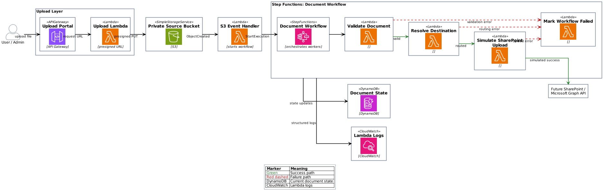

# S3 Lambda Step Functions SharePoint Workflow

Serverless AWS CDK demo showing S3 uploads, Lambda workers, Step Functions orchestration, DynamoDB tracking, and failure handling.

## Problem

Enterprise document workflows need more than file upload. They need a clear path for orchestration, state tracking, retries, failures, and operational visibility.

This project models a document intake workflow where a file lands in S3, moves through a Step Functions workflow, records state in DynamoDB, and simulates a SharePoint upload.

Real SharePoint integration is intentionally out of scope for the first version.

## Architecture



```text
Upload Portal
  -> presigned S3 POST
  -> private S3 bucket
  -> S3 ObjectCreated event
  -> S3 Event Handler Lambda
  -> Step Functions
  -> Validate Document Lambda
  -> Resolve Destination Lambda
  -> Simulate SharePoint Upload Lambda
  -> DynamoDB COMPLETE
```

Failure path:

```text
Worker Lambda fails
  -> Step Functions catch
  -> Mark Workflow Failed Lambda
  -> DynamoDB FAILED
  -> Step Functions execution ends failed
```

## AWS Services

- **AWS CDK**: Infrastructure as code.
- **S3**: Private source bucket for uploaded documents.
- **API Gateway + Lambda**: Minimal upload portal and presigned URL creation.
- **Lambda**: Workflow workers and S3 event handler.
- **Step Functions**: Orchestration, retry, and catch/failure path.
- **DynamoDB**: Document workflow state tracking.
- **CloudWatch Logs**: Lambda logs through `console.log` and `console.error`.

## Code Map

```text
lib/s3-sharepoint-workflow-stack.ts
  CDK stack, resources, permissions, Step Functions wiring

lambda/upload-portal.ts
  Browser upload page and presigned S3 URL creation

lambda/s3-event-handler.ts
  S3 event -> DynamoDB RECEIVED -> Step Functions StartExecution

lambda/validate-document.ts
  File extension validation and VALIDATED/FAILED state

lambda/resolve-destination.ts
  Department routing based on S3 key prefix

lambda/simulate-sharepoint-upload.ts
  Simulated SharePoint boundary and COMPLETE state

lambda/mark-workflow-failed.ts
  Step Functions catch handler and FAILED state

lambda/shared/tracking.ts
  DynamoDB state update helper
```

## Run Locally

Install dependencies:

```powershell
npm install
```

Run tests:

```powershell
npm test
```

Type-check:

```powershell
npm run build
```

Synthesize CloudFormation:

```powershell
npx cdk synth --profile s3-sharepoint-learning
```

Deploy:

```powershell
npx cdk deploy --profile s3-sharepoint-learning --require-approval never
```

## Live Demo

A temporary deployed demo is available here:

https://0pxnu0ijm5.execute-api.us-east-1.amazonaws.com/prod/

Use a small supported file type:

```text
.pdf, .docx, .xlsx, .csv, .txt
```

The demo uploads to a private S3 bucket through a short-lived presigned POST, then starts the Step Functions workflow. Uploaded files are limited to 5 MB and expire from the bucket after 1 day.

Note: this is a learning/demo deployment and may be disabled after review.

## Demo Test

Use the deployed upload portal URL from the CDK stack output:

```text
UploadPortalUrl
```

Upload a supported file type:

```text
.pdf, .docx, .xlsx, .csv, .txt
```

Expected result:

```text
S3 object created
Step Functions execution succeeds
DynamoDB status becomes COMPLETE
CloudWatch contains Lambda logs
```

To test failure, upload an unsupported file type through S3 Console or CLI.

Expected result:

```text
Validate Document fails
Mark Workflow Failed runs
DynamoDB status becomes FAILED
Step Functions execution ends failed
```

## Notes On Presigned URLs

The S3 bucket remains private. The upload portal creates a short-lived presigned POST that allows one browser upload to one specific S3 key.

The POST policy does not allow listing, reading, deleting, or changing other objects. It also limits demo uploads to 5 MB.

## Enterprise Extensions

This is a thin working path. In a production migration, the next additions would be:

- Real SharePoint or Microsoft Graph integration.
- Authentication in front of the upload portal.
- SQS and dead-letter queues for buffering and replay.
- CloudWatch alarms and dashboards.
- Malware scanning and file size validation.
- Batch migration worker for large document sets.
- Stronger idempotency and retry policies.
- Separate dev/test/prod AWS accounts and tighter IAM.
